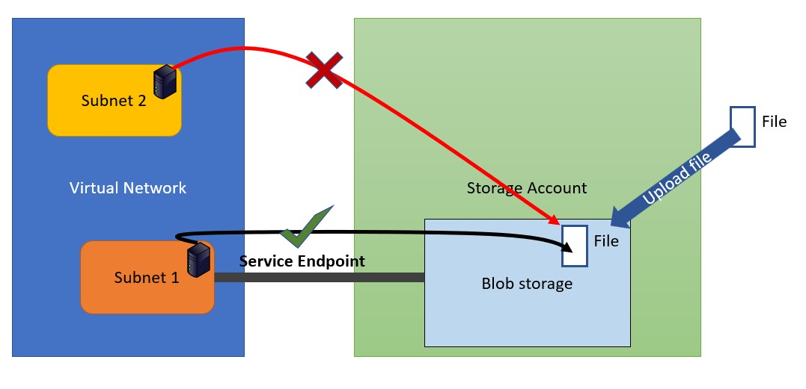

<!--
    <details><summary>Click for hint</summary><Strong> 

    ``` 
    HINT
    ```
    </Strong></details> 
    <details><summary>Click to see the answer</summary><Strong> 
    
    ```
    ANSWER
    ```
    </Strong></details> 
-->
# Azure Access to Storage account via a Service Endpoint



# Use following outline to complete this project

- Create a Virtual Network
  - Choose the VNet address range yourself
  - Create two subnets in the Vnet
  - Subnet 1
    - From the first subnet create a service endpoint to Storage Account services
    - Create a Windows VM within the first subnet 
  - Subnet 2
    - From the second subnet DO NOT create a service endpoint to Storage Account services
    - Create a Windows VM within the second subnet 
- Create a Storare Account (configure it as follows)
  - Create a Blob storage (Container) 
  - Do not allow anonymous access
  - Add a file to the blob storage
  - Make sure the Storage Accounts network settings only allows access from Subnet 1 of the above VNet
  - Generate a SAS token for the uploaded file and use the SAS token URL when testing access below 
- On the VM in subnet 1 
  - Run this code on the VM to disable the enhanced browser security (Run PowerShell as Administrator)
  ```PowerShell
  function Disable-InternetExplorerESC {
    $AdminKey = "HKLM:\SOFTWARE\Microsoft\Active Setup\Installed Components\{A509B1A7-37EF-4b3f-8CFC-4F3A74704073}"
    $UserKey = "HKLM:\SOFTWARE\Microsoft\Active Setup\Installed Components\{A509B1A8-37EF-4b3f-8CFC-4F3A74704073}"
    Set-ItemProperty -Path $AdminKey -Name "IsInstalled" -Value 0 -Force
    Set-ItemProperty -Path $UserKey -Name "IsInstalled" -Value 0 -Force
    Stop-Process -Name Explorer -Force
    Write-Host "IE Enhanced Security Configuration (ESC) has been disabled." -ForegroundColor Green
  }

  Disable-InternetExplorerESC
  ```
  - Attempt to use the URL to access the file that was uploaded to the blob store
- On the VM in subnet 2 
  - Run this code on the VM to disable the enhanced browser security (Run PowerShell as Administrator)
  ```PowerShell
  function Disable-InternetExplorerESC {
    $AdminKey = "HKLM:\SOFTWARE\Microsoft\Active Setup\Installed Components\{A509B1A7-37EF-4b3f-8CFC-4F3A74704073}"
    $UserKey = "HKLM:\SOFTWARE\Microsoft\Active Setup\Installed Components\{A509B1A8-37EF-4b3f-8CFC-4F3A74704073}"
    Set-ItemProperty -Path $AdminKey -Name "IsInstalled" -Value 0 -Force
    Set-ItemProperty -Path $UserKey -Name "IsInstalled" -Value 0 -Force
    Stop-Process -Name Explorer -Force
    Write-Host "IE Enhanced Security Configuration (ESC) has been disabled." -ForegroundColor Green
  }

  Disable-InternetExplorerESC
  ```
  - Attempt to use the URL to access the file that was uploaded to the blob store

## What must the lab achieve

- One Vnet
- Two Subnets
- First subnet has a service enpoint configured to Storage Accounts
- Storage Account configured with a blob storage and configured to restrict access

## Test if your Azure security

- After creating the structure above
  - Make sure you can access the blob store from subnet 1
  - Make sure you cannot access the blob store from subnet 2

## Clean up 
- Remove all the Resource Groups that you have created 
   
