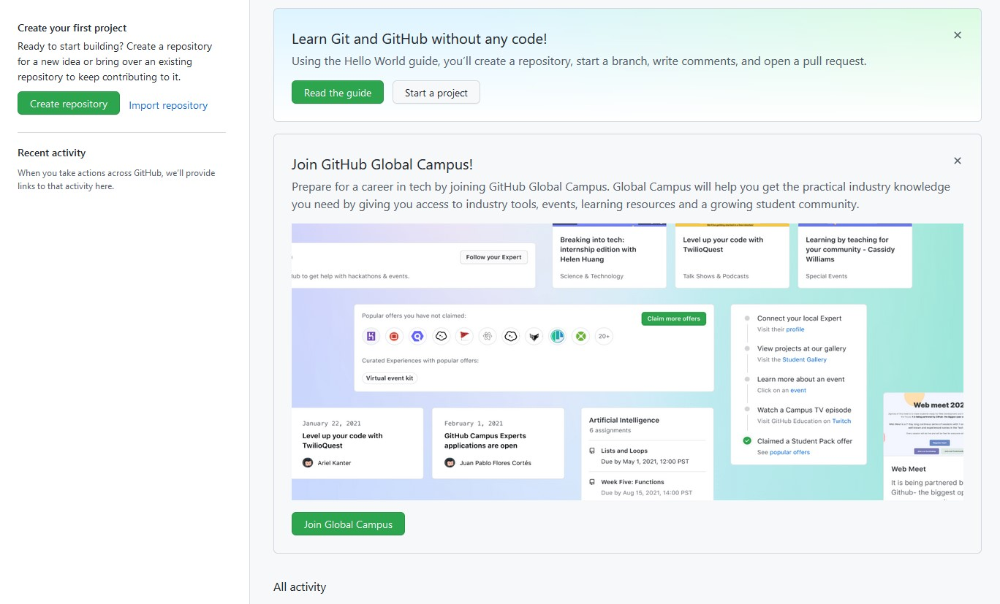

# Setup your own GitHub Site

## Create Github Site 

### 1. Sign up
- Open a web browser (Chrome preferred) and go to  [https://www.github.com](https://www.github.com) *(do not use Internet Explorer)* 
- Click **Sign Up** link

---

### 2. Enter your email address
- Type your **email address** on this screen
- Click **Continue**

---

### 3. Enter a password
- Type a **password** on this screen
- **IMPORTANT!** Please remember the Email Address and Password as you will use them throughout the course
- Click **Continue**

---

### 4. Enter a Username
- Type a **username** on this screen (Something no one else has chosen)
- Click **Continue**
- This name will become your GitHub repository name

---

### 5. Choose No 
- Type **n** to the question about receiving product updates
- Click **Continue**

---

### 6. Verify Account
- Click **start puzzle** to verify you are not a robot

---

### 7. Complete Puzzle
- Choose the **picture** that satisfies the puzzle
- You may need to do this several times

---

### 8. Create Account
- Click **Create Account** to finish the sign up process

---

### 9. Enter Code
- Check your email inbox (*This is the email that you used to sign up for GitHub*)
- Find the email that was sent from Github and make note of the **code** that they sent you
- Back in the GitHub web site, enter the **code** in the following screen

---

### 10. Choose how you will use GitHub
- Choose **Just Me** from the top section 
- Choose **Student** from the bottom section

---

### 11. Select None of the Features 
- Click **Continue** without selecting any features

---

### 12. Choose the Free option
- Click **Continue for free** option

---

### 13. Wait for the Dashboard
- A message will display Initializing your dashboard...
- Wait a few seconds and it the show the dashboard

---

### 14. Dashboard Appears
- This is the inital dashboard
- **Read the guide** is the documentation for GitHub, so read this later if you wish
- Do nothing on this screen yet

---

### 15. Create Your First Repository
- Click **Create repository**

---

### 16. Configure and Create the Repository
- Type the ***name*** of your first repository (Make sure the name is available)
- Make sure it is set to **public**
- Click **Add a README file**
- Click **Create Repository**

---

 
 

**Well done, your repository is created**

---
---

[Next Lab - Explore your Repo](2-ExploreRepo.md#lets-explore-the-repository)
