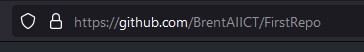
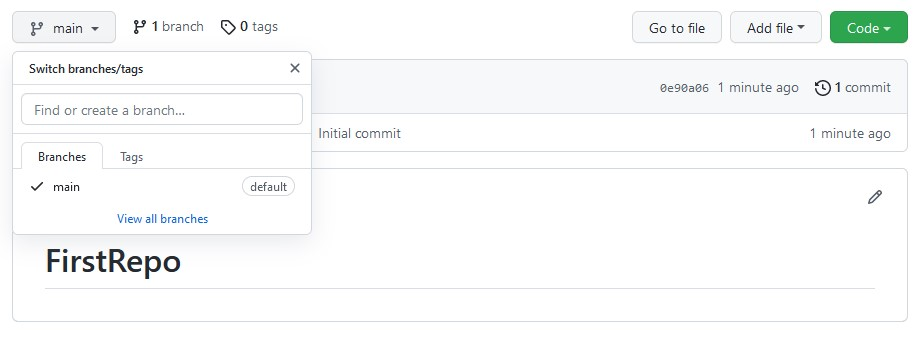
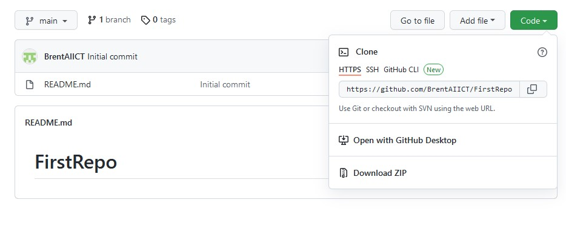
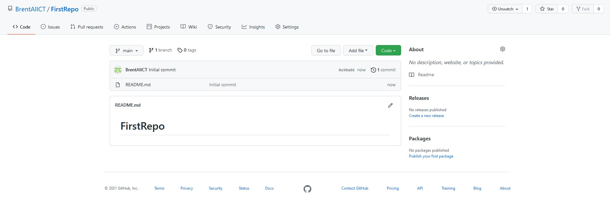
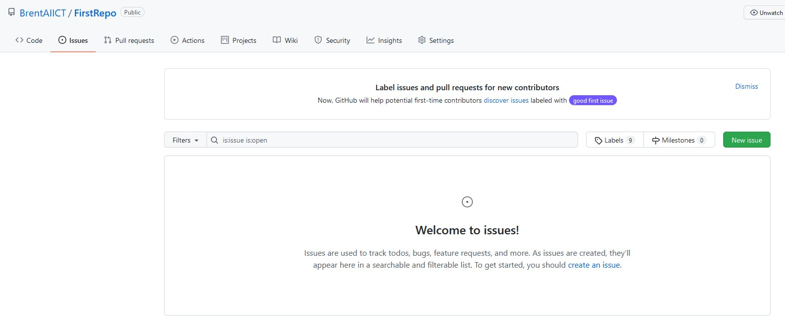
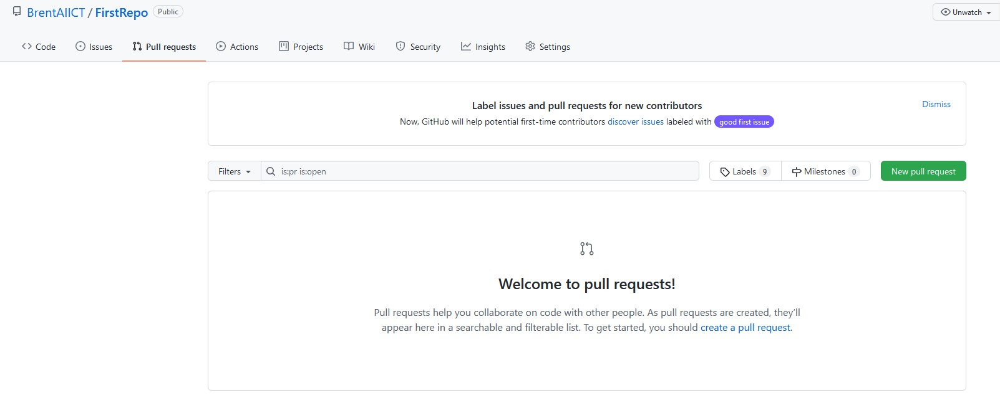
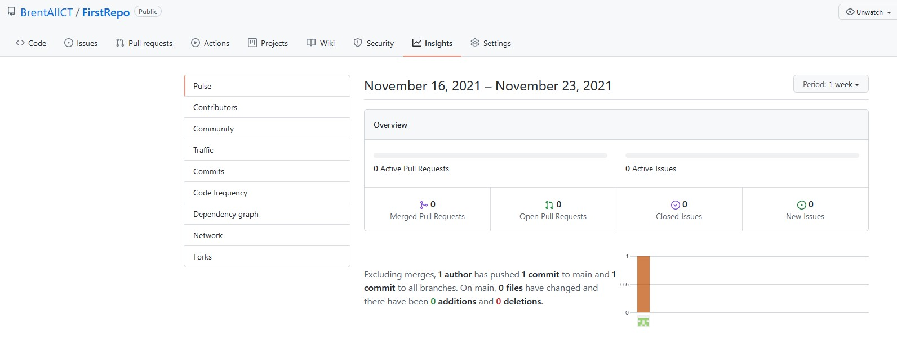

# Lets Explore the Repository

## Lets look around your new "Repo" (this is a common name for repository)

***We are not making changes to the Repo in this section***

### Before we start
- Take note of the **GitHub URL** in the top of the web browser
  - This consists of the **GitHub Site** name and the **Repository name** 
- Example: 
  - My GitHub site is **https://github.com/BrentAIICT**
  - My Repo name is **FirstRepo**
- Make sure you record your GitHub site and Repository names for later

---

### 1. Inspect the Branches
- Click on **main**
- ensure it shows only the main branch

---

### 2. Clone information under "Code"
- Click on **Code** (The Green Button)
- Under the clone section you will see a URL "https://githuib.com/....."
- This is the URL we will use later, for cloning the Repo to our local PC

---

### 3. Find the Files in the Repo
- Click on **<>Code** Menu Item (Top Left)
- This shows you the files that are stored in this repo

---

### 4. Issues That Others Have Raised
- Click on **Issues** Menu Item
- This section is where we can record problems or suggestions for feature improvements
- You could add an issue by clicking the green button **New Issue** 

---

### 5. Check for Pull Requests
- Click on **Pull Requests** Menu Item
- Under this section you can issue a pull request
- This allows the changes made in this repository to be checked and merged into the main branch

---

### 6. Reports on How the Repo is Used
- Click on **Insights** Menu Item
- Under this section you will see inforamtion regarding what is happening to the repo 
- Here we can track pull requests and issues under Pulse
- We can see the merged branches under Network
- And many other aspects

---

 
 

---
---

[Next Lab - Install and configure Local Git Repo](3-InstallLocalGit.md#installing-and-configuring-git-on-your-local-computer)

