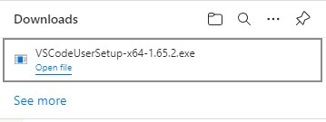
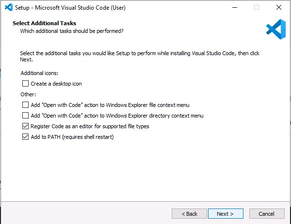

# Install VSCode Editor

## Download VSCode Installer 

### 1. Download VSCode
- Open a web browser and go to  [https://code.visualstudio.com/Download](https://code.visualstudio.com/Download) *(do not use Internet Explorer)* 
- Click on the **64 Bit** blue rectangle, next to User Installer, under the Windows box

---

### 2. Wait for the download to start and complete
- The download web page will appear and in a few seconds, on the top right of the screen you will see the download progress

---

### 3. Find the downloaded file
- click the three dots **...** on the top right of the web browser
- Click **Downloads**

---

### 4. Run the VSCode installer
- Click **Open File**

---

### 5. Setup Warning ⚠ 
- If you see a warning appear
- Click **OK**

---

### 6. Agree to the License Agreement 
- Click **I accept the agreement** radio button
- Click **Next >**

---

### 7. Select Destination Location
- Do not edit the default location 
- Click **Next >**

---

### 8. Select Start Menu Folder
- Click **Next >** to accept the default folder name

---

### 9. Select Additional Tasks 
- Click **Next >** to accept the default settings

---

### 10. Ready to Install
- Click **Next >** to Install VSCode

---

### 11. Installing
- Wait for the installation to complete

---

### 12. Installation Complete
- Untick the **Launch Visual Studio Code** check box
- Click **Finish**

---

### 13. Close the web browser
- Click the **X** on the top right of the web browser to clode it

---

### 14. Start VSCode
- Type **VSCode** in the "Type here to search" box
- Click **Visual Studio Code**

---

### 15. Open a Folder Within VSCode
- Click on the **File** menu
- Click **Open Folder**
- Back in the GitHub web site, enter the **code** in the following screen

---

### 16. Open Folder
- Click **Documents**
- Click **GitHome**
- Click **Select Folder**

---

### 17. Trust Authors
- Click **Yes, I trust the authors** box

---

### 18. Show contents of FirstRepo
- Click **FirstRepo** to display its contents
  - *Your list of files will be different to the ones shown here*

---

### 19. Create a new file
- Right Click on **FirstRepo**
- Click **New File**

---

### 20. Name the new file
- type **TestScript.ps1** in the blue box
- Hit **ENTER**

---

### 21. Install the recommended extension 
- Click **Install** in the blue box

---

### 22. PowerShell extension installs
- Wait for the extension to complete

---

[Next Lab - Commit changes to a file with VSCode](7-GitInVSCode.md#git-is-easy-to-use-from-vscode)
