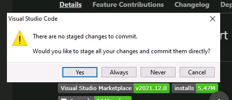

# Git is easy to use from VSCode

## These first set of steps are entered once when you first set up VSCode 

### 1. Click on Source Control icon
- Within VSCode click on the **Source Control** icon on the left
  - It should have a number 1 in a circle


---

### 2. Type a message in the blue commit box 
- In the blue commit box, type a message to describe the changes made to the file
- This is the equivalent message in the git command
  - git commit -m "Message"
- Click the **Tick** icon above the massage box


---

### 3. No staged changes to commit ⚠ 
- Click **Always** as this will automatically add changes to git whenever you commit


---

### 4. Sync changes back to your GitHub repository
- Click **Sync Changes 1**


---


### 5. Push and Pull commits ⚠ 
- Click **OK, Don't Show Again**


---

### 6. Enter the GitHub Access Token 
- Click **Token** 
- Type the **GitHub Access Token** you recorded from an earlier lab
- Click **Sign in**


---

<br><br>

# Normal git/GitHub workflow 

## Normal git/GitHub workflow from VSCode

*These steps are the normal git workflow, you will not have to repeat some of the previous steps* 

### 1. Locate the files in VSCode 
- Click on the **Explorer** icon in VSCode


---

### 2. Open TestScript.ps1
- Click **TestScript.ps1** to open the file in the VSCode editor


---

### 3. Make a change to the script 
- Type the folowing into the editor window 
   ```PowerShell
   # This is a comment line to make a change to the script
   ```


---


### 4. Save the changes to TestScript.ps1
- Click **File** menu
- Click **Save** from the file menu


---


### 5. Note the Source Control icon
- Note that the **Source Control** icon has a 1 next to it now


---

### 6. Click on Source Control 
- Click the **Source Control** icon


---

### 7. Type a message in the blue commit box 
- In the blue commit box, type a message to describe the changes made to the file
- This is the equivalent message in the git command
  - git commit -m "Message"
- Click the **Tick** icon above the massage box


---

### 8. Sync changes back to your GitHub repository
- Click **Sync Changes 1**


---

*You have now successfully made changes to the repository and syncronised Git and GitHub using VSCode*

