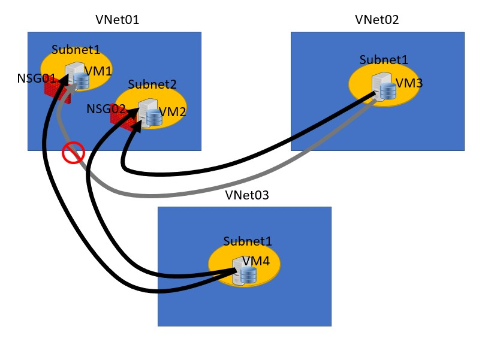

<!--
    <details><summary>Click for hint</summary><Strong> 

    ``` 
    HINT
    ```
    </Strong></details> 
    <details><summary>Click to see the answer</summary><Strong> 
    
    ```
    ANSWER
    ```
    </Strong></details> 
-->
# Azure Network Security Challenge



# Use following brief to complete this project

- Create three Virtual Networks (VNet01, VNet02, VNet03)
- Create the inter-VNet infrastructure to allow the required routes below to succeed 
- *(Optional) Set up an Private DNS Service and to allow the VM1 and VM2 machines to be accessed by name*
- VNet01
  - IPAddress: 10.1.0.0/16
  - Subnet1: 10.1.0.0/24
    - Create NSG rule that allows web traffic from VM4 to VM1 and VM2 for http traffic
    - Create NSG rule that allows web traffic from VM3 to VM2 for http traffic
  - Subnet2: 10.1.1.0/24
    - Create NSG rule that allows web traffic from VM4 to VM1 and VM2 for http traffic
  - Two Virtual Machines (VM1, VM2)
    - join VM1 to subnet1
    - join VM2 to subnet2
  - VM1
    - OS: Windows 2019 Server
    - IP: Fixed IP address 10.1.0.10/24
    - Feature Installed: Web Server
  - VM2
    - OS: Windows 2019 Server
    - IP: Fixed IP address 10.1.1.20/24
    - Feature Installed: Web Server
- VNet02
  - IPAddress: 131.107.0.0/16
  - Subnet1:  131.107.0.0/24
  - One Virtual Machine (VM3)
  - VM3
    - OS: Windows 2019 Server
    - IP: Dynamic IP address 
    - Feature Installed: None
- VNet03
  - IPAddress: 197.10.0.0/16
  - Subnet1: 197.10.0.0/24
  - One Virtual Machine (VM4)
    - Add VM4 to subnet1
  - VM4
    - OS: Windows 2019 Server
    - IP: Dynamic IP address 
    - Feature Installed: None
    
## What must the lab achieve

- Creation of the network infrastructure 
- VM1 and VM2 as web servers
- Create the routing infrastructure needed to communicate VNet to VNet
- NSG rules to allow only the allowed machine access 

## Test if your Azure security

- After creating the infrastructure 
  - Open a web browser on VM3 and VM4 and try to access the VM1 and VM2 websites using the private IP addresses
  - VM3 should be able to access both VM1 and VM2 private IP addresses
  - VM4 should only be able to access VM2 private IP address
  - VM1 and VM2 should not be able to contact each others website using the private IP addresses
- Optional - access the VM1 and VM2 via their names (Private DNS)

## Clean up 
- Remove all the Resource Groups that you have created 
<br>

[Next Project](AzureProject2.md#azure-role-based-access-project)

