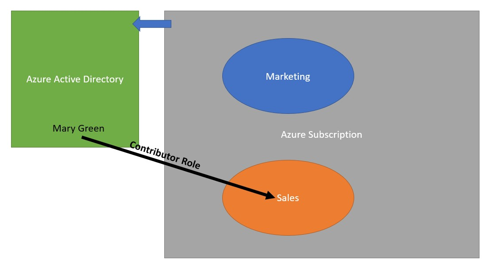

<!--
    <details><summary>Click for hint</summary><Strong> 

    ``` 
    HINT
    ```
    </Strong></details> 
    <details><summary>Click to see the answer</summary><Strong> 
    
    ```
    ANSWER
    ```
    </Strong></details> 
-->
# Azure Role Based Access Project



# Use following outline to complete this project

- Create a new user in Azure Active Directory
  - Name: Mary Green
  - First Name: Mary 
  - Last Name: Green
  - Usage Location to be: United States
  - Job Title: Sales IT Manager
  - Depeartment: SalesIT
  - Make sure the system generates a random password (and make sure you copy that password before creating the user account)
- Create two Resource Groups
  - Name: Sales
  - Name: Marketing
- In the Sales Resource Group
  - add the following to the Role Based Access Control
    - Add Mary Green as a Contributor 
- Do not modify the Marketing Resource Group 
- Logout and then login as Mary Green
  - Attempt to create a Virtual Network in the Sales Resource Group 
    - Choose any settings you like for the VNet
  - Attempt to create a Virtual Network in the Marketing Resource Group

## What must the lab achieve

- Creation of two Resource Groups
- Adding a new user in Azure AD
- Giving rights to the new user to add a resource  

## Test if your Azure security

- After creating the structure above
  - Make sure you can create a resource in the Sales Resource Group
  - Make sure you cannot create a resource in the Marketing Resource Group

## Clean up 
- Remove all the Resource Groups that you have created 
<br>

[Next Project](AzureProject3.md#azure-access-to-storage-account-via-a-service-endpoint)   
