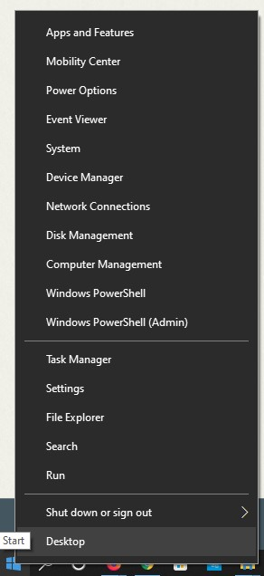

# Installing and Configuring Git on Your Local Computer 

## Download and Install Git

### 1. Download Git
- Go to this web site [https://git-scm.com/downloads](https://git-scm.com/downloads) (do not use Internet Explorer) 
- Click on the **Download for Windows** link
- *Save the file if you are prompted to do so*

---

### 2. Wait for the installer file to download
- On the bottom left of the chrome browser you will see the stratus of the download

---

### 3. Start File Explorer
- right click the **Start** menu 
- click **File Explorer**

---

### 4. Run the Git installer file
- Within the File Explorer program go to the **Downloads** folder
- locate the **Git-#.##.#-64bit.exe** file (# represents a number)
- Right click on this file and choose **Open**

---

### 5. If needed, answer yes to the User Account Control
- Click on **Yes** if the User Account Control window appears

---

### 6. License Agreement
- You can read the agreement if you wish
- Click **Next**

---

### 7. Destination Location
- If you wish to change the install loication you can do so here
- Click **Next**

---

### 8. Folder Exists (This may not show on your install)
- If this shows up on your install
- Click **Yes**

---

### 9. Component Selection
- Make sure your window looks like this one
- Click **Next**

---

### 10. Start Menu Folder
- Do not change anything here
- Click **Next**

---

### 11. Choose default editor
- If you do not have VSCode installed Click **Next**
- *if you do have VSCode installed proceed to the next instruction*

---

### 12. Optional (VSCode Editor)
- If you did have VSCode installed
- Change your install setup to look like this 
- Click **Next**

---

### 13. Name of Initial Branch
- Choose the **Override** option
- Ensure the branch name is Main
- Click **Next** 

---

### 14. Adjusting the PATH 
- Ensure your install looks like this
- Click **Next**

---

### 15. Choosing SSH
- Ensure your install looks like this
- Click **Next**

---

### 16. Choosing HTTPS
- Change the settings to looks like this
- Click "Next"

---

### 17. Congiuring Line Endings
- Ensure your install looks like this
- Click **Next**

---

### 18. Configuring the Terminal
- Change the settings to looks like this
- Click **Next**

---

### 19. Default Behaviour of git pull
- Ensure your install looks like this
- Click **Next**

---

### 20. Credential Manager
- Ensure your install looks like this
- Click **Next**

---

### 21. Extra options
- Ensure your install looks like this
- Click **Next**

---

### 22. Experimental options
- Ensure your install looks like this
- Click **Next**

---

### 23. Installing
- Wait for the Install to complete

---

### 24. Finish the Install
- Change the settings to looks like this
- Click **Finish**

---

 
 

**Well done, Git is installed**

---
---

[Next Lab - Clone your Repo](4-CloneRepo.md#clone-a-github-repo)
