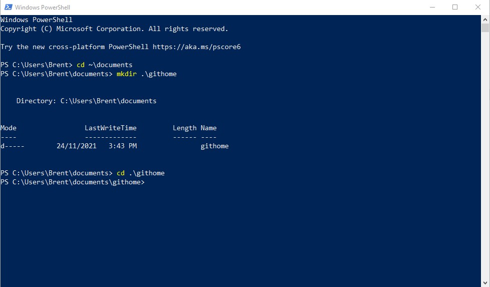
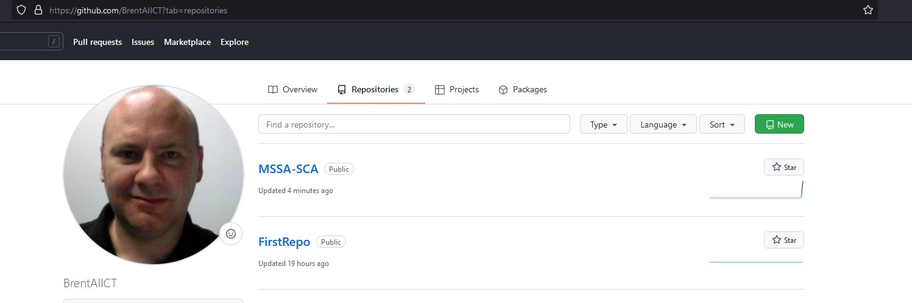
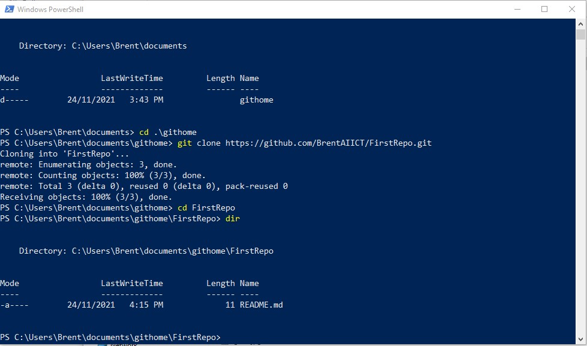

# Clone a GitHub Repo

## Cloning 

### 1 Open PowerShell
- Click the **Start** menu and type PowerShell
- Click **Windows Powershell**

---

### 2. Create Git Home folder in your Documents folder
- From the PowerShell windows type: **cd ~\Documents**
- Hit the **ENTER** key
- Now type: **mkdir .\githome**
- Hit the **ENTER** key

---

### 3. Go to your githome folder
- From the PowerShell windows type: **cd .\githome**
- Hit the **ENTER** key
- Leave the PowerShell window open as we will come back to it soon

---

### 4. Go to your Git Hub site
- Open a web browser (Chrome preferred) and go to **your GitHub site** you recoded earlier *(do not use Internet Explorer)* 

---

### 5. Repositories
- On the GitHub site 
- Click the **Repositories** menu 

---

### 6. Locate your Repo
- Click on the **name** of your repository

---

### 7. Find and Copy the Clone URL
- Click on the Green **Code** button
- Copy the URL listed by clicking **the two boxes icon** to the right of the URL

---

### 8. Clone your GitHub Repo on your own PC
- Go back to the PowerShell window you left open *from step 3*
- In the PowerShell window type: **git clone URLfromStep7**

---

### 9. Clone your GitHub Repo on your own PC
- In the PowerShell window type: **cd YourRepoName**
- Example: 
  - My Repo is called FirstRepo
  - So I would type: **cd FirstRepo** 

---

### 10. Make sure the Repo was cloned successfully
- From the PowerShell window type: **dir**
- If you see a **README.md** file you have been successful

---

### 11. Locate the Git Repo
- Right click **Start** menu and type **PowerShell**
- Click **Windows PowerShell**
- In the PowerShell window type **cd ~\documents\githone\YourRepoName**

---

### 12. User Configuration - Git
- In the PowerShell window type **git config --global user.name "Your name"**
- Hit the **ENTER** key

---

### 13. Email configuration - Git
- In the PowerShell window type **git config --global user.email "Your email address"**
- Hit the **ENTER** key

---

### 14. Check the Configuartion
- In the PowerShell window type **git config --list**
- Hit the **ENTER** key
- Make sure your name and email are set correctly

---

 
 

**Well done, your repository is created**

---
---

[Next Lab - Managing the Repositories](5-ManagingGitRepo.md#managing-a-local-git-repo)

